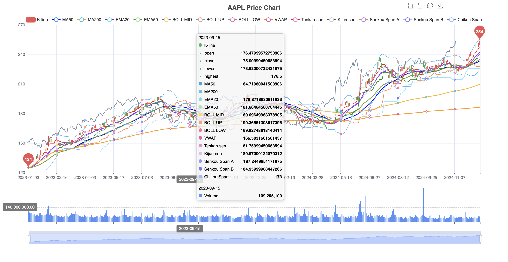

# AAPL Stock Price Trend

Welcome to the **AAPL Stock Price Trend** website! This project provides a detailed analysis of Apple (AAPL) stock trends using various technical indicators.

## Website

You can view the  website here:   [https://siiiiiiiiiiii.github.io/AAPL-stock-price-trend/](https://siiiiiiiiiii.github.io/AAPL-stock-price-trend/)

## Chart

## Project Files

This repository contains the following key files:
- **AAPL stock price trend.ipynb**: A Jupyter Notebook that includes data analysis and visualization code for Apple stock prices.
- **index.html**: The main HTML file used for the GitHub Pages deployment.
- **README.md**: This file provides an overview of the project and instructions for accessing and using the website.

## Features

The website includes the following features:
- **K-line (Candlestick Chart)**: Shows daily open, close, high, and low prices.
- **Moving Averages (MA50, MA200)**: Indicates long-term trends.
- **Exponential Moving Averages (EMA20, EMA50)**: Highlights short-term trends.
- **Bollinger Bands**: Visualizes price volatility (BOLL MID, BOLL UP, BOLL LOW).
- **VWAP (Volume-Weighted Average Price)**: Useful for intraday trends.
- **Ichimoku Components**: Displays momentum and support/resistance levels.
- **Volume Data**: Includes volume below the price chart.
- **Interactive Timeline Slider**: Zoom in and out for specific periods.

## How to Use

1. Open the[ https://siiiiiiiiiiii.github.io/AAPL-stock-price-trend/ ](https://siiiiiiiiiii.github.io/AAPL-stock-price-trend/)in your browser.
2. Explore the candlestick chart and technical indicators.
3. Use the timeline slider to analyze specific date ranges.

### Future Improvements
- Add support for more stock tickers.
- Include real-time data updates using APIs.
- Enhance visualizations with more technical indicators.

## Acknowledgments
This project was partially inspired by tutorials from Runoob.com. The tutorial "Python 量化股票 K 线图" provided valuable insights for implementing candlestick chart visualizations.  
Reference: Python 量化股票 K 线图 | 菜鸟教程. (2017). Runoob.com.  
[https://www.runoob.com/python-qt/python-stock-line-chart.html](https://www.runoob.com/python-qt/python-stock-line-chart.html)

## AI Contribution
This project was  supported by ChatGPT. 

